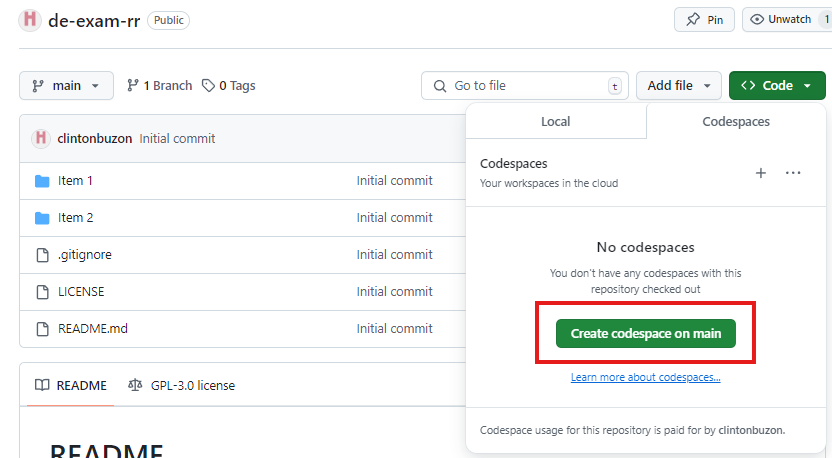
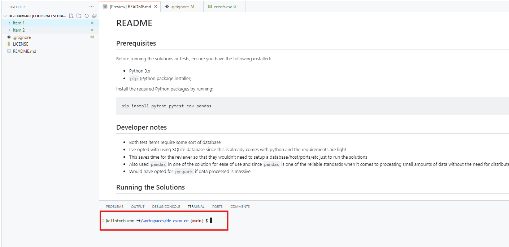

# README

## You can run this on GitHub Codespaces or your local environment

### GitHub Codespace

Create a codespace on the `main` branch.



Run commands in the codespace terminal.




## Prerequisites

Before running the solutions or tests, ensure that you have the following installed:

- Python 3.x
- `pip` (Python package installer)

You can install the required Python packages by running:

```sh
pip install pytest pytest-cov pandas
```

## Developer Notes

- Both test items require some sort of database.
- I’ve chosen to use an SQLite database since it comes with Python by default, and the requirements are light.
- This approach saves time for the reviewer, as they won’t need to set up a database, host, ports, etc., just to run the solutions.
- I’ve also used pandas in one of the solutions for ease of use, as it is a reliable standard for processing small amounts of data without the need for distributed processing.
- I would have opted for pyspark if the data processed were massive.


## Running the Solutions

### Item 1

Note: The provided events.ndjson file appears to be corrupted, with missing brackets and lines that aren't in JSON format. I’ve manually cleaned this file so that the source data is in a proper format.

To run the solution.py file in Item 1, follow these steps:
```sh
cd "Item 1"
python solution.py
```

This will:

- Create an SQLite database.
- Process the NDJSON events file from source/events.ndjson and load it into the database.
- Export the results to target/events.csv.

Optionally, you can run the following command to start an SQL terminal on the created database:

```sh
sqlite3 events.db
SELECT * FROM events_table;
```

#### Results

`events.csv` contents:
```
event_date,event_timestamp,event_name,ga_session_id,engaged_session_event,page_location,page_title,page_referrer,source
20231005,1696470452486466,scroll,123526748,1,https://mobile.deexam.ph/,J's Angels,,
20231005,1696470418877027,page_view,84321567,1,https://web.deexam.ph/,SuperJ,http://m.facebook.com/,m.facebook.com
```

### Item 2

To run the solution.py file in Item 2, follow these steps:

```sh
cd "Item 2"
python solution.py
```

This will:

- Create an SQLite database.
- Load data from CSV files (date.csv, stores.csv, fsl.csv).
- Create a view with YTD/MTD/WTD sales calculations.
- Print out the results from the view.

Optionally, you can run the following command to start an SQL terminal on the created database:

```sh
sqlite3 sales.db
SELECT * FROM store_sales_view;
```

#### Results

Assuming current date is `2023-02-14`

`store_sales_view` results:
```
['STORE_KEY', 'STORE_CODE', 'STORE_DESCRIPTION', 'YTD_SALES', 'MTD_SALES', 'WTD_SALES']
(44538, 'd7d38f0c', '3db96c1c', 17742293.79, 5113440.45, 442562.5)
(44557, '2ddcb26f', 'e3df592e', 9888081.02, 2777991.0300000003, 321203.0)
```

`store_sales_view_yearly` results:
```
['STORE_KEY', 'STORE_CODE', 'STORE_DESCRIPTION', 'YEAR', 'YEARLY_SALES']
(44538, 'd7d38f0c', '3db96c1c', '2023', 17742293.79)
(44557, '2ddcb26f', 'e3df592e', '2023', 9888081.02)
```

`store_sales_view_monthly` results:
```
['STORE_KEY', 'STORE_CODE', 'STORE_DESCRIPTION', 'YEAR_MONTH', 'MONTHLY_SALES']
(44538, 'd7d38f0c', '3db96c1c', '2023-01', 12628853.34)
(44538, 'd7d38f0c', '3db96c1c', '2023-02', 5113440.45)
(44557, '2ddcb26f', 'e3df592e', '2023-01', 7110089.99)
(44557, '2ddcb26f', 'e3df592e', '2023-02', 2777991.0300000003)
```

`store_sales_view_weekly` results:
```
['STORE_KEY', 'STORE_CODE', 'STORE_DESCRIPTION', 'YEAR', 'WEEK', 'WEEKLY_SALES']
(44538, 'd7d38f0c', '3db96c1c', '2023', '00', 757826.75)
(44538, 'd7d38f0c', '3db96c1c', '2023', '01', 3820702.36)
(44538, 'd7d38f0c', '3db96c1c', '2023', '02', 2565333.5)
(44538, 'd7d38f0c', '3db96c1c', '2023', '03', 2521952.0)
(44538, 'd7d38f0c', '3db96c1c', '2023', '04', 2571433.48)
(44538, 'd7d38f0c', '3db96c1c', '2023', '05', 2513154.95)
(44538, 'd7d38f0c', '3db96c1c', '2023', '06', 2549328.25)
(44538, 'd7d38f0c', '3db96c1c', '2023', '07', 442562.5)
(44557, '2ddcb26f', 'e3df592e', '2023', '00', 486456.55)
(44557, '2ddcb26f', 'e3df592e', '2023', '01', 2134881.81)
(44557, '2ddcb26f', 'e3df592e', '2023', '02', 1372138.63)
(44557, '2ddcb26f', 'e3df592e', '2023', '03', 1360397.0)
(44557, '2ddcb26f', 'e3df592e', '2023', '04', 1489469.0)
(44557, '2ddcb26f', 'e3df592e', '2023', '05', 1229928.03)
(44557, '2ddcb26f', 'e3df592e', '2023', '06', 1493607.0)
(44557, '2ddcb26f', 'e3df592e', '2023', '07', 321203.0)
```

## Running Tests

To run the tests for both Item 1 and Item 2 using pytest with coverage reporting, follow these steps:

### Item 1

```sh
cd "Item 1"
pytest -v --cov=solution --cov-report=term-missing
```

### Item 2

```sh
cd "Item 2"
pytest -v --cov=solution --cov-report=term-missing
```